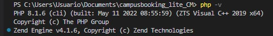
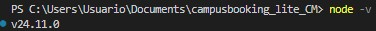
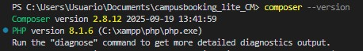
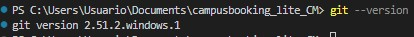
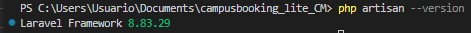
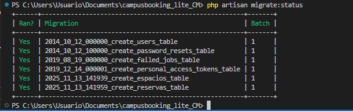
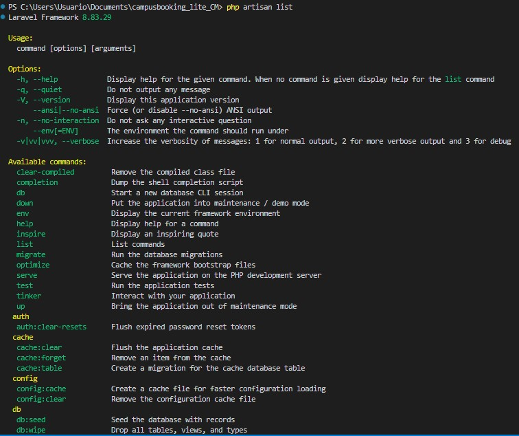

#  CampusBooking Lite – Espacios y Reservas  
**Proyecto en Laravel – CRUD de Espacios y Reservas**

Este proyecto implementa un sistema ligero para gestionar **Espacios** (aulas, laboratorios, salas) y **Reservas** internas de manera simple: crear, listar, editar y eliminar.  
Cumple con los requisitos establecidos en la guía **GTH-F-062 V10**.

---

##  1. Contexto  
La sede necesita un módulo interno mínimo para registrar espacios y gestionar reservas básicas.  
El sistema **NO** requiere autenticación, búsquedas avanzadas ni reglas complejas.

---

#  2. Alcance  

### ✔ Incluye:
- Proyecto Laravel completo.
- 2 entidades:
  - **Espacio**
  - **Reserva**
- Migraciones + Modelos + Controladores Resource + Vistas Blade.
- Relación **1 – N**:
  - Un *Espacio* tiene muchas *Reservas*.
  - Una *Reserva* pertenece a un *Espacio*.
- Paginación simple (10 por página).
- Mensajes flash en create/update/delete.

###  Excluye:
- Autenticación
- Soft deletes
- Búsquedas/filtrado
- Validación estricta de solapamientos (aunque se implementó como mejora)

---

#  3. Requisitos funcionales  

##  CRUD de Espacios
**Campos:**
- id
- nombre (req)
- tipo (req)
- capacidad (req ≥ 1)
- ubicación (req)
- timestamps

**Validación:**
- `nombre`, `tipo`, `ubicacion`: `required|string|max:255`
- `capacidad`: `required|integer|min:1`

---

##  CRUD de Reservas
**Campos:**
- id  
- espacio_id (FK)
- solicitante (req)
- fecha (date req)
- hora_inicio (time req)
- hora_fin (time req)
- motivo (nullable)
- timestamps

**Validación:**
- `espacio_id`: required|exists:espacios,id  
- `solicitante`: required|string|max:255  
- `fecha`: required|date  
- `hora_inicio`, `hora_fin`: required|date_format:H:i  

**Requisito:**  
En la tabla de Reservas se muestra el **nombre del Espacio** vía relación.

---

#  4. Implementación técnica  

###  Modelos | Relaciones  
Entregadas en la guia **GTH-F-062 V10**.

#   5. Rutas principales 
Una ruta en espacios el controlador
Una ruta en espacios para reservas 

# 6. Vistas Blade mínimas

Para cada entidad:

- index.blade.php
- create.blade.php
- edit.blade.php
- show.blade.php
- partials/form.blade.php

# 7. Instalación del proyecto
Clonar repositorio
- git clone https://github.com/tuusuario/campusbooking_lite_CM.git
- cd campusbooking_lite_CM

# Instalar o verificar dependencias
Ver capturas de pantalla 

# 8. Capturas de pantalla

### Comprobación de herramientas instaladas

#### PHP

#### Node

#### NPM

#### Composer

#### Git

#### Laravel

#### Migraciones

#### Comandos subir repositorio a git

#### Comandos framework

---

# 9. Videos del funcionamiento

Guarda los videos en:

### CRUD funcional – Video 1
[Ver video 1](docs/videos/Lista de CRUD funcional 1  - Brave 2025-11-15 19-52-47.mp4)

### CRUD funcional – Video 2
[Ver video 2](docs/videos/Lista de CRUD funcional 2 - Brave 2025-11-15 18-33-13.mp4)